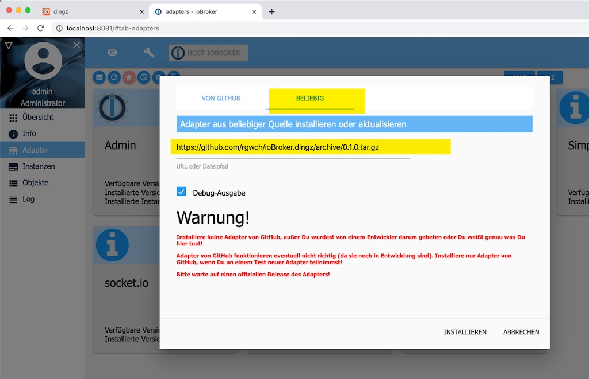
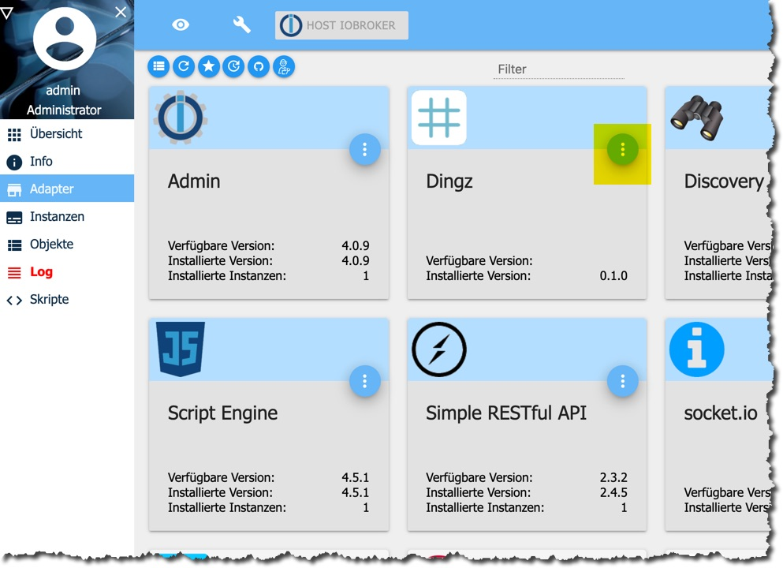
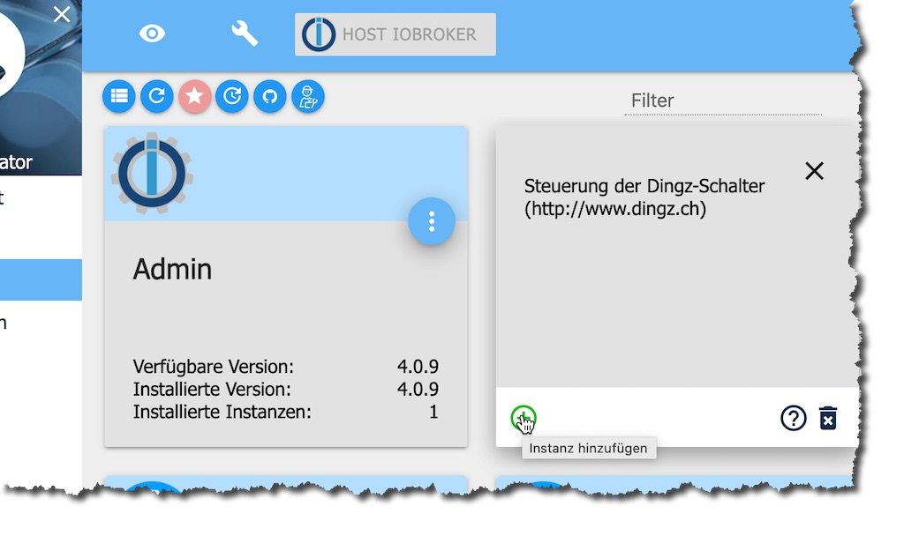
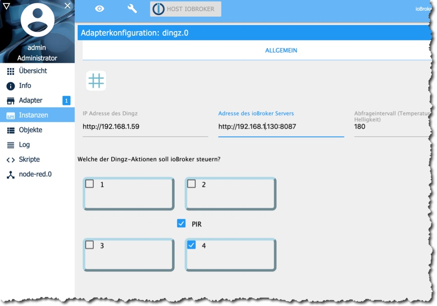

[](https://www.npmjs.com/package/iobroker.dingz)
[](https://travis-ci.com/rgwch/ioBroker.dingz)

# ioBroker.dingz

## What it is

This is an adapter to connect [Dingz](http://dingz.ch) devices with the [ioBroker](http://iobroker.net) home automation system. A Dingz device features four programmable buttons, a thermometer, and optionally a PIR motion detector. Each button can either switch and/or dim lights directly, control sun blinds, or send a random http request to control other devices. Connectors to [Philips Hue](https://www2.meethue.com/de-ch) and [Sonos](https://www.sonos.com/de-ch) are built-in.

Each button can issue separate actions on single press, double press and long press (2 seconds or more). 

With this adapter, Dingz can control anything in the ioBroker ecosystem.

Note: This version supports a limited subset of Dingz features:
- act on single/double/long press of any of the buttons
- read thermometer value

## Hardware installation

Please refer to the informations on the product's homepage. You'll need to connect to the mains power. Depending on the laws of the country where you live, this is only legal for professional electricians. In any case it's dangerous. So better call an electrician anyway.

Besides the mains current connection, any or all of the buttons can connect to lights, sun blinds, electric heating valves and others. Unconnected buttons can still be operated by software and issue random commands over WiFi.

## Software Installation

### Prerequisites

- A working instance of [ioBroker](http://www.iobroker.net). If you only want a quick test-install, I recommend using [docker](https://www.docker.com/):  
`docker run -p 8081:8081 -p 8087:8087 -p 8082:8082 --name iobroker -v iobrokerdata:/opt/iobroker buanet/iobroker:latest`

- At least the adapter "Simple RESTful API" must be installed in the ioBroker instance.

### Fetch and install ioBroker.Dingz

This adapter is not part of the official ioBroker distribution. So it will not show up in ioBroker admin's adapter list.
You can install it either directly via NPM:

[](https://nodei.co/npm/iobroker.dingz/)

or as a custom adapter from the admin-ui (http://{ioBroker-address}:8081):


Make sure to select "Beliebig" even though it's situated on Github:



Find out the release you're interessed in: <https://github.com/rgwch/ioBroker.dingz/releases> and copy/paste the address of the .tar.gz link.

Read the warning and click "install" if you agree anyway.

The adapter should then be in the admin pages's list:



Click on the three dots near the right upper corner and then on the **+** sign in the lower left corner to create a new instance. You need a separate instance for each Dingz in your Home.



The configuration dialog should open after successful creation of the instance. 

## Configuration



Enter the IP Address of the Dingz for this instance. You need also to indicate the address of the ioBroker server and the port you've set when configuring the "Simple RESTful" Adapter. By default, that's 8087. The symbolic network name of the ioBroker Server, e.g. `http://homecontrol.local:8087` will probably not work, so better find out the IP address, e.g. in the router's network list (And while you're there, you'll probably want to instruct the DHCP server to always give the same address to the Dingz and to the ioBroker server.)

In the lower part you can define, which of the 4 Buttons should be controlled by ioBroker. The other buttons are left to direct programming of the Dingz via its App or its Web Server. Do not mix direct programming and ioBroker control. A Button can only have one controller. But a button can be physically wired to a light and still act on ioBroker programming. 

## Use

The Dingz adapter No. X (starting with 0) will create ioBroker states for every button Y it controls:

* dingz.X.buttons.Y.single 
* dingz.X.buttons.Y.double
* dingz.X.buttons.Y.long

And for the temperature:

* dingz.X.temperature

Detailed informations on the Dingz and its connection state are found in dingz.X.info

Use the states in ioBroker Scripting or VIS UI design to react on user interactions with a controlled button (direct press or via app/web control). Example:

```javascript
const b4="dingz.0.buttons.4.";
const aussenlicht="lightify.0.aussenlicht.on";

on({id:b4+"single"},()=>{
    log("Button 4 single press received","info")
    // Garden lights on for 3 Minutes
    setState(aussenlicht,true)
    setTimeout(()=>{
      setState(aussenlicht,false)
    },180000)
})

on({id:b4+"double"},()=>{
    log("Button 4 double press received","info")
})

on({id: b4+"long"},()=>{
  log("Someone pressed Dingz Button 4 for more than 2 seconds!","info")
  setState("tradfri.0.xyz",true)
  setState("boombox.1.volume","100%")
  if(getState("dingz.0.temperature").val > 19){
    setState("musicbox.songselect","we are the champions")
  }else{
    setState("musicbox.songselect","it's cold inside")
  }
})
```


## Changelog

### 0.2.0
 * (rgwch) added press_release state
 * Better handling of connection failures

### 0.1.0
* (rgwch) initial release

## License
MIT License

Copyright (c) 2020 rgwch <rgw@rgw.ch>

Permission is hereby granted, free of charge, to any person obtaining a copy
of this software and associated documentation files (the "Software"), to deal
in the Software without restriction, including without limitation the rights
to use, copy, modify, merge, publish, distribute, sublicense, and/or sell
copies of the Software, and to permit persons to whom the Software is
furnished to do so, subject to the following conditions:

The above copyright notice and this permission notice shall be included in all
copies or substantial portions of the Software.

THE SOFTWARE IS PROVIDED "AS IS", WITHOUT WARRANTY OF ANY KIND, EXPRESS OR
IMPLIED, INCLUDING BUT NOT LIMITED TO THE WARRANTIES OF MERCHANTABILITY,
FITNESS FOR A PARTICULAR PURPOSE AND NONINFRINGEMENT. IN NO EVENT SHALL THE
AUTHORS OR COPYRIGHT HOLDERS BE LIABLE FOR ANY CLAIM, DAMAGES OR OTHER
LIABILITY, WHETHER IN AN ACTION OF CONTRACT, TORT OR OTHERWISE, ARISING FROM,
OUT OF OR IN CONNECTION WITH THE SOFTWARE OR THE USE OR OTHER DEALINGS IN THE
SOFTWARE.

## More like this

* ['MyStrom WiFi Switch' Adapter](http://github.com/rgwch/ioBroker.mystrom-wifi-switch)
* ['MyStrom WiFi Button' Adapter](http://github.com/rgwch/ioBroker.mystrom-wifi-button)
* ['MyStrom WiFi Bulb' Adapter](http://github.com/rgwch/ioBroker.mystrom-wifi-bulb)
